# Captain Frank Flight Funnel - Project Documentation

## Table of Contents
1. [Architecture Diagram](#architecture-diagram)
2. [User Journey Flow](#user-journey-flow)
3. [Project Overview](#project-overview)
4. [Tech Stack](#tech-stack)
5. [Project Structure](#project-structure)
6. [Components Architecture](#components-architecture)
7. [Netlify Functions](#netlify-functions)
8. [API Services](#api-services)
9. [Routing & Pages](#routing--pages)
10. [State Management](#state-management)
11. [Internationalization](#internationalization)
12. [Development Setup](#development-setup)
13. [Build & Deployment](#build--deployment)

---

## Architecture Diagram


## User Journey Flow

```mermaid
flowchart LR
    Start([User Visits Site]) --> Lang{Choose Language<br/>DE/EN}
    Lang --> Phase1[Phase 1<br/>Initial Assessment]
    
    Phase1 --> Phase2[Phase 2<br/>Flight Details]
    
    Phase2 --> Search[Search Flights<br/>or Manual Entry]
    Search --> Phase3[Phase 3<br/>Compensation Estimate]
    
    Phase3 --> Calc[Calculate<br/>Compensation Amount]
    Calc --> Phase4[Phase 4<br/>Trip Experience]
    
    Phase4 --> Questions[Answer Detailed<br/>Questions]
    Questions --> Phase5[Phase 5<br/>Agreement & Signature]
    
    Phase5 --> Sign[Digital Signature<br/>& Document Upload]
    Sign --> Submit[Submit Claim]
    
    Submit --> API{Evaluate Claim<br/>API}
    API -->|Accepted| Success[Claim Success<br/>Reference Number]
    API -->|Rejected| Reject[Claim Rejected<br/>Reasons Provided]
    
    Success --> CRM[HubSpot CRM<br/>Lead Created]
    
    style Start fill:#e1f5e1,stroke:#4caf50,stroke-width:2px
    style Success fill:#e1f5e1,stroke:#4caf50,stroke-width:2px
    style Reject fill:#ffe1e1,stroke:#f44336,stroke-width:2px
```



---

## Project Overview

The Captain Frank Flight Funnel is a sophisticated multi-step web application designed to help passengers claim compensation for delayed or cancelled flights within the EU. The application guides users through a comprehensive claim process, from initial assessment to final submission.

### Key Features
- 🌐 **Bilingual Support** - Full German and English language support
- ✈️ **Flight Search Integration** - Real-time flight search and validation
- 💰 **Compensation Calculator** - Automatic calculation based on EU regulations
- 📄 **Document Management** - Secure document upload and processing
- 🔄 **Progressive Form Flow** - Step-by-step guided process with validation
- 📧 **CRM Integration** - Seamless HubSpot integration for lead management

---

## Tech Stack

### Core Framework
- **Next.js 15.3.2** - React framework with App Router
- **React 18.3.1** - UI library
- **TypeScript 5.2.2** - Type safety and developer experience

### State Management
- **Zustand 5.0.2** - Lightweight state management solution
- **Immer 10.1.1** - Immutable state updates

### Styling & UI
- **Tailwind CSS 3.3.3** - Utility-first CSS framework
- **Framer Motion 10.16.4** - Animation library
- **Radix UI** - Headless UI components
  - Accordion, Dialog, Popover, etc.
- **Lucide React** - Modern icon library

### Form Handling
- **React Hook Form 7.46.1** - Performant form management
- **React Datepicker 4.18.0** - Date selection component
- **React Signature Canvas 1.1.0-alpha.2** - Digital signature capture
- **date-fns 2.30.0** - Date utility functions

### Internationalization
- **next-intl 3.26.5** - Comprehensive i18n solution

### Backend & Serverless
- **Netlify Functions** - Serverless backend functions
- **Node.js 20+** - Runtime environment

### Development Tools
- **ESLint** - Code linting
- **TypeScript** - Type checking

### Additional Libraries
- **styled-components 6.1.13** - CSS-in-JS
- **pako 2.1.0** - Compression library
- **vaul 1.1.2** - Drawer/Sheet component
- **use-debounce 10.0.4** - Debounce hook
- **class-variance-authority 0.7.1** - CSS class utilities
- **clsx 2.1.1** - Utility for className strings
- **tailwind-merge 1.14.0** - Merge Tailwind CSS classes

---

## Project Structure

```
captain-frank-flight-funnel/
├── src/
│   ├── app/                    # Next.js App Router
│   │   ├── [lang]/            # Internationalized routes
│   │   │   ├── phases/        # Multi-step claim pages
│   │   │   └── layout.tsx     # Root layout
│   │   └── api/               # API route handlers
│   │
│   ├── components/            # React components
│   │   ├── client/           # Client-side components
│   │   ├── shared/           # Shared components
│   │   │   ├── ModularFlightSelector/
│   │   │   ├── navigation/
│   │   │   ├── forms/
│   │   │   └── wizard/
│   │   └── ui/               # UI primitives
│   │       ├── button/
│   │       ├── input/
│   │       ├── layout/
│   │       └── date/
│   │
│   ├── store/                # State management (Zustand)
│   │   ├── slices/          # Store slices
│   │   │   ├── userSlice.ts
│   │   │   ├── flightSlice.ts
│   │   │   ├── navigationSlice.ts
│   │   │   ├── claimSlice.ts
│   │   │   ├── coreSlice.ts
│   │   │   ├── phase4Slice.ts
│   │   │   ├── phaseSlice.ts
│   │   │   ├── validationSlice.ts
│   │   │   ├── wizardSlice.ts
│   │   │   ├── travelStatusWizardSlice.ts
│   │   │   └── informedDateWizardSlice.ts
│   │   ├── hooks/           # Store hooks
│   │   ├── index.ts         # Main store
│   │   └── types.ts         # Store types
│   │
│   ├── services/             # API services
│   │   ├── api.ts           # Base API client
│   │   ├── flightService.ts
│   │   ├── claimService.ts
│   │   ├── evaluateService.ts
│   │   ├── navigation.ts
│   │   └── phaseNavigation.ts
│   │
│   ├── hooks/               # Custom React hooks
│   ├── utils/               # Utility functions
│   ├── translations/        # i18n files
│   ├── types/              # TypeScript definitions
│   ├── config/             # Configuration files
│   ├── providers/          # React providers
│   ├── styles/             # Global CSS files
│   └── middleware.ts       # Next.js middleware
│
├── netlify/
│   └── functions/          # Serverless functions
│       ├── searchFlights.ts
│       ├── searchAirports.ts
│       ├── calculateCompensation.ts
│       ├── evaluateeuflightclaim.ts
│       ├── ordereuflightclaim.ts
│       ├── submitFlightNotListed.ts
│       ├── upload-documents.js
│       └── hubspot-integration.js
│
├── public/                 # Static assets
├── next.config.js         # Next.js configuration
├── netlify.toml          # Netlify configuration
├── package.json          # Dependencies
└── tsconfig.json         # TypeScript configuration
```

---

## Components Architecture

### Shared Components (`/src/components/shared/`)

#### ModularFlightSelector
Complex flight selection system with:
- Airport search with autocomplete
- Date selection
- Flight number validation
- Real-time flight data integration

#### Navigation Components
- **LanguageSwitcher** - Toggle between DE/EN
- **Navbar** - Main navigation
- **PhaseNavigation** - Step indicator

#### Form Components
- **PersonalDetailsForm** - User information collection
- **SignaturePad** - Digital signature capture
- **ConsentCheckbox** - GDPR compliance

#### Wizard Components
- **Phase1QAWizard** - Initial assessment questionnaire
- **Phase4QAWizard** - Trip experience questionnaire
- **WizardNavigation** - Step controls

### UI Components (`/src/components/ui/`)

#### Button Components
- **BackButton** - Navigation back
- **ContinueButton** - Primary CTA
- **SecondaryButton** - Alternative actions
- **ShareButton** - Social sharing

#### Input Components
- **Input** - Text input fields
- **DateInput** - Date selection
- **MoneyInput** - Currency formatting
- **Select** - Dropdown selection
- **Checkbox** - Boolean selection
- **Textarea** - Multi-line input

#### Layout Components
- **Card** - Content containers
- **Sheet** - Modal-like overlays
- **Section** - Page sections
- **Footer** - Page footer

#### Display Components
- **Headlines** - Typography components
- **SpeechBubble** - Chat-like display
- **QADisplay** - Q&A formatting
- **ErrorMessage** - Error display
- **ProgressBar** - Loading states

---

## Netlify Functions

Located in `/netlify/functions/`:

### 1. **searchFlights.ts**
- Searches for flights based on route and date
- Integrates with external flight data API
- Returns flight numbers and schedules

### 2. **searchAirports.ts**
- Airport autocomplete functionality
- Returns IATA codes and airport names

### 3. **calculateCompensation.ts**
- Calculates compensation based on EU 261/2004
- Considers flight distance and delay duration
- Returns compensation amount in EUR

### 4. **evaluateeuflightclaim.ts**
- Evaluates eligibility for compensation
- Checks airline, route, and circumstances
- Returns eligibility status

### 5. **ordereuflightclaim.ts**
- Submits final claim to backend
- Processes all collected data
- Returns claim reference number

### 6. **submitFlightNotListed.ts**
- Handles manual flight entry
- For flights not found in search

### 7. **upload-documents.js**
- Handles file uploads
- Validates file types and sizes
- Returns upload confirmation

### 8. **hubspot-integration.js**
- Creates/updates HubSpot contacts
- Tracks claim progress
- Manages marketing automation

---

## API Services

### Next.js API Routes (`/src/app/api/`)
The application includes Next.js API routes that proxy requests to Netlify functions:
- `/api/check-eligibility` - Eligibility checking
- `/api/evaluateeuflightclaim` - Claim evaluation
- `/api/searchairportsbyterm` - Airport search
- `/api/searchflightsbyfromiatatoiatadatenumber` - Flight search
- `/api/submit-missing-flight` - Manual flight entry
- `/api/upload-documents` - Document upload

### Base API Client (`/src/services/api.ts`)
- Centralized request handling
- Error management
- Authentication headers
- Request/response interceptors

### Service Modules

#### FlightService (`/src/services/flightService.ts`)
```typescript
- fetchFlights(params) // Default export - searches flights
```

#### ClaimService (`/src/services/claimService.ts`)
```typescript
- static evaluateClaim() // Evaluates claim eligibility
- static orderClaim() // Submits final claim
- static getWizardAnswers() // Gets wizard state
- static getTravelStatusAnswers() // Gets travel status
```

#### EvaluateService (`/src/services/evaluateService.ts`)
```typescript
- static evaluateClaim() // Evaluates claim with flight data
```

#### Navigation Services
- **navigation.ts** - Navigation state management
- **phaseNavigation.ts** - Phase-specific navigation logic

---

## Routing & Pages

### Multi-Phase Flow Structure

All routes are prefixed with `[lang]` for internationalization:

1. **`/`** - Landing page
   - Introduction to service
   - Start claim button

2. **`/phases/initial-assessment`** - Phase 1
   - Basic eligibility questions
   - Flight type determination
   - EU regulation checks

3. **`/phases/flight-details`** - Phase 2
   - Flight search and selection
   - Manual entry option
   - Flight validation

4. **`/phases/compensation-estimate`** - Phase 3
   - Compensation calculation
   - Amount display
   - Proceed to claim option

5. **`/phases/trip-experience`** - Phase 4
   - Detailed questionnaire
   - Delay reasons
   - Additional circumstances

6. **`/phases/agreement`** - Phase 5
   - Terms acceptance
   - Digital signature
   - Document upload
   - Final submission

7. **`/phases/claim-submitted`** - Success
   - Confirmation message
   - Reference number
   - Next steps

8. **`/phases/claim-rejected`** - Rejection
   - Ineligibility explanation
   - Alternative options

### Phase Guards
- Prevents skipping steps
- Validates completion status
- Redirects to appropriate phase

---

## State Management

### Store Architecture (Zustand)

The application uses a centralized Zustand store with multiple slices:

#### User Slice (`userSlice.ts`)
```typescript
- personal information
- contact details
- consent status
- signature data
```

#### Flight Slice (`flightSlice.ts`)
```typescript
- flight search results
- selected flights
- airport data
- flight validation
```

#### Navigation Slice (`navigationSlice.ts`)
```typescript
- current phase tracking
- completed phases
- phase navigation
- route management
```

#### Claim Slice (`claimSlice.ts`)
```typescript
- claim data
- compensation amounts
- submission status
- claim reference
```

#### Phase4 Slice (`phase4Slice.ts`)
```typescript
- trip experience data
- questionnaire responses
- additional circumstances
```

#### Wizard Slice (`wizardSlice.ts`)
```typescript
- wizard state management
- step tracking
- form data persistence
```

#### Additional Slices
- **CoreSlice** (`coreSlice.ts`) - Core application state
- **PhaseSlice** (`phaseSlice.ts`) - Phase completion tracking
- **ValidationSlice** (`validationSlice.ts`) - Form validation state
- **TravelStatusWizardSlice** - Travel status questionnaire
- **InformedDateWizardSlice** - Date information wizard

### State Persistence
- Local storage integration
- Session recovery
- Cross-tab synchronization

---

## Internationalization

### Language Support
- **German (de)** - Primary language
- **English (en)** - Secondary language

### Implementation
- URL-based locale detection (`/de/`, `/en/`)
- Automatic language detection
- Manual language switching
- Translation files in `/src/translations/`

### Translation Structure
```
translations/
├── de.ts          # German translations
├── en.ts          # English translations
├── index.ts       # Translation exports
└── types.ts       # Translation types
```

---

## Development Setup

### Prerequisites
- Node.js 20.0.0 or higher
- npm or yarn package manager

### Installation
```bash
# Clone the repository
git clone [repository-url]

# Install dependencies
npm install

# Set up environment variables
cp .env.example .env.local
```

### Environment Variables
```env
# HubSpot Integration
HUBSPOT_API_KEY=
HUBSPOT_API_TOKEN=
HUBSPOT_FORM_GUID=
HUBSPOT_PORTAL_ID=

# Environment
NEXT_PUBLIC_ENV=
```

### Development Commands
```bash
# Start development server
npm run dev

# Start production server
npm run start

# Type checking
npm run type-check

# Linting
npm run lint

# Run all checks
npm run check
```

---

## Build & Deployment

### Build Process
```bash
# Build Next.js app and Netlify functions
npm run build

# Build functions only
npm run build:functions
```

### Deployment Configuration

#### Netlify Configuration (`netlify.toml`)
- Build settings
- Function configuration
- Redirect rules
- Environment variables

#### Production URLs
- Main domain configuration
- Function endpoints
- API routing

### Deployment Checklist
- [ ] Environment variables configured
- [ ] API keys secured
- [ ] Build successful
- [ ] Functions compiled
- [ ] Type checking passed
- [ ] Linting passed
- [ ] Translations complete
- [ ] CORS configured

---

## Additional Notes

### Security Considerations
- API keys stored in environment variables
- CORS properly configured
- Input validation on all forms
- Secure document upload handling

### Performance Optimizations
- Code splitting by route
- Lazy loading components
- Image optimization
- CSS purging in production

### Browser Support
- Modern browsers (Chrome, Firefox, Safari, Edge)
- Mobile responsive design
- Progressive enhancement

---

## Contact & Support

For technical questions or support regarding this project, please contact me at roderickfmoise@gmail.com.

**Last Updated:** June 25, 2025
**Version:** 0.1.0
